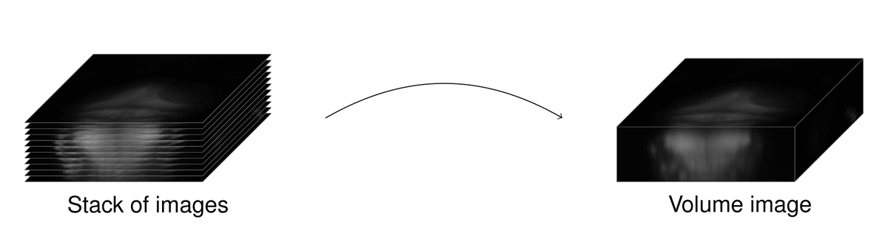
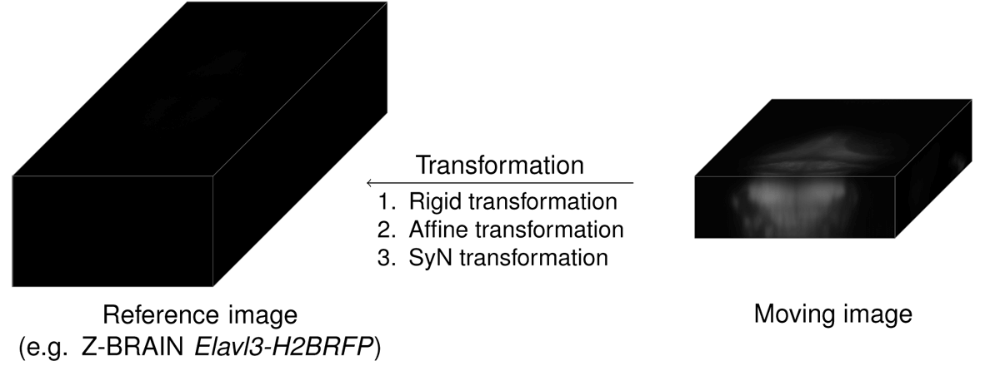
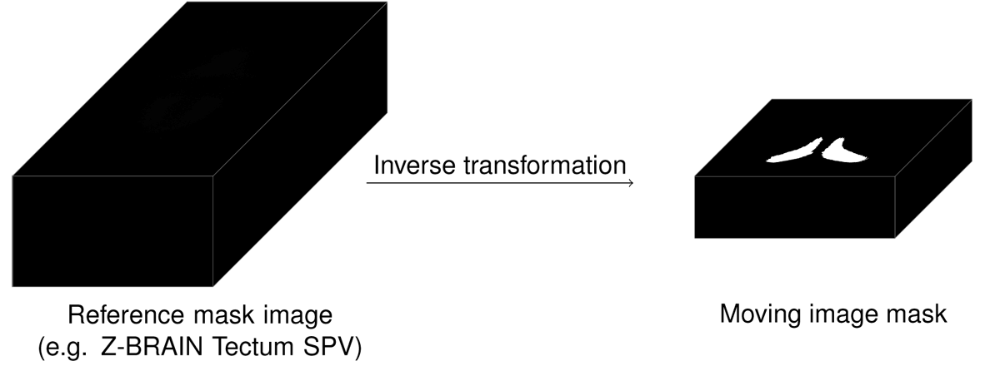

# Z-BRAIN Registration & Segmentation

In this repository, we establish a pipeline for the registration and segmentation of volumetric neuroimaging data of neural activity in the larval zebrafish brain.

## Overview

The idea of this work is to first register a summary volume image of a larval zebrafish's brain to a common reference atlas. In a second step, the transformation which describes this registration and specifically its inverse is used to map the brain regions that are defined in the reference atlas back which results in a segmentation of the data.

As the common reference atlas, we use the Z-BRAIN atlas, which has been created by the group around Florian Engert at Harvard University and has since become widely adopted in the zebrafish community as an atlas for neuroanatomical features of the larval zebrafish (Randlett et al., 2015).

Note, that we use the atlas in its initial form (Z-BRAIN 1.0), consisting of three files, the Z-BRAIN reference brain stack (`Ref20131120pt14pl2.nrrd`), an anatomy label database (`AnatomyLabelDatabase.hdf5`), and a mask database (`MaskDatabase.mat`). These files can be obtained from the official [Z-BRAIN project](https://engertlab.fas.harvard.edu/LegacyZ-Brain/downloads.html) website.

For the image processing, we use the *Advanced Normalization Tools* (ANTs) and the associated Python libraries, *Advanced Normalization Tools for Python* (ANTsPy) (Avants et al.).

## Requirements

The code was written in Python 3 and tested under Python 3.9.1. In addition, the following packages

* ANTsPyX (`antspyx` - tested under version 0.2.6, compiled from source) with its dependencies (NumPy, SciPy, Pandas, Matplotlib, scikit-image, scikit-learn, etc.),
* HDF5 for Python (`h5py` - tested  under version 2.10.0), and
* Tifffile (`tifffile` - tested under version 2021.3.5)

are required.

Beyond that and as mentioned above, we require the Z-BRAIN 1.0 dataset for the registration. Alternatively, a custom reference atlas can be manually assembled and used from the Z-BRAIN 2.0 dataset.

## Usage

In the following, we will briefly describe the main steps of our pipeline. While the meaning of most of the command line arguments should be clear from context, we refer to the help pages of the different functions for their definition.

1. In order to register the data to the Z-BRAIN atlas, we need to extract the relevant data from the Z-BRAIN dataset and bring it into a form that's most suitable for processing.
   
   ```
   python Z-BRAIN-atlasCreation.py --name "Z-BRAIN 2x2x2" --output-directory Data/Atlases --Z-BRAIN-directory Data/Z-BRAIN/ --spacing 2 2 2
   ```

   This will create the reference atlas as the spatial resolution of 2µm per pixel in every spatial direction in the directory `Data/Atlases/Z-BRAIN 2x2x2` that we will use in the following.

2. If the neuroimaging dataset consists of summary images for the individual imaging planes, we need to combine those into a volume image (the "moving image").

   

   ```
   python volumeImage.py from-plane-images --plane-images Data/<imaging dataset>/*.tif --plane-image-order S --plane-orientation P R --plane-spacing 0.2426 0.2426 --plane-height 7.5 --output-file Data/<imaging dataset>/<imaging dataset>.nrrd
   ```

   This will combine the set of images `Data/<imaging dataset>/*.tif` given their orientation and spatial resolution into a volume image `Data/<imaging dataset>/<imaging dataset>.nrrd`. Here the set of images is interpreted as ordered from superior to inferior and the individual images are oriented so that the vertical axis goes from posterior to anterior and the horizontal axis from right to left, with no in-plane rotation.

3. Given the reference atlas created above and the moving image, we can perform the registration. For the registration, we use the SynQuick['s'] transformation (Favre-Bulle et al., 2018).

   

   ```
   python imageRegistration.py --reference-atlas-directory Data/Atlases/Z-BRAIN\ 2x2x2 --atlas-registration-label Elavl3-H2BRFP --moving-data-directory Data/<imaging dataset> --moving-image <imaging dataset>.nrrd
   ```

   This will perform the registration of the moving image to the Elavl3-H2BRFP label defined in the reference atlas and save the corresponding transformation as well as its inverse for later use.

4. Following the registration, we can use the inverse transformation to map the brain regions defined in the reference atlas back onto the moving image.

   

   ```
   python maskTransformation.py --reference-atlas-directory Data/Atlases/Z-BRAIN\ 2x2x2 --moving-data-directory Data/<imaging dataset> --moving-image <imaging dataset>.nrrd
   ```

   This will take every mask of a brain region and transform it into a mask for the moving image. Following the transformation, this also applies an optimization procedure which first performs a dilation-erosion sequence and second removes small connected components.

This the completes pipeline. The warped masks can be used directly to look-up the affiliation of a point in the moving image to a certain brain region and thus yields a segmentation.

5. Depending on how the imaging data is processed following its registration and segmentation it can be useful to work with stacks of plane images again rather than volume images.

   ```
   python volumeImage.py to-plane-images --volume-image Data/<imaging dataset>/<imaging dataset>.nrrd --plane-image-order S --plane-orientation P R --output-file Data/<imaging dataset>/<imaging dataset>.tif
   ```

   This will create stack of plane images in order from superior to inferior and the individual images oriented so that the vertical axis goes from posterior to anterior and the horizontal axis from right to left and save them in a Multipage-TIFF file.

6. For various reasons, we might want to export images of the segmentation.

   ```
   python segmentationExport.py --moving-data-directory Data/<imaging dataset> --moving-image <imaging dataset>.nrrd --plane-order I --plane-orientation A L --output-file-format <output directory>/Plane-{} --export-format image --right-hemisphere-mask "Hemispheres :: Right"
   ```

   This will take every mask of the moving image and extracts their contours in planes along a principal axis and writes them to image files. These can be either JSON files for [labelme](https://github.com/wkentaro/labelme) or simple image files in the PNG format. A mask for the right hemisphere, `Hemispheres :: Right`, is used to distinguish between regions in the left and right hemisphere. The images will be ordered from inferior to superior and oriented so that the vertical axis goes from anterior to posterior and the horizontal axis from left to right.

## References

O. Randlett, C. L. Wee, E. A. Naumann, O. Nnaemeka, D. Schoppik, J. E. Fitzgerald, R. Portugues, A. M. B. Lacoste, C. Riegler, F. Engert, and A. F. Schier. "Whole-brainactivity mapping onto a zebrafish brain atlas". *Nat. Methods* **12** (2015), 1039-1046. DOI: [10.1038/nmeth.3581](https://doi.org/10.1038/nmeth.3581).

B. B. Avants, N. J. Tustison, H. J. Johnson, et al. Advanced Normalization Tools (ANTs). URL: https://github.com/ANTsX/ANTs.

B. B. Avants, N. J. Tustison, H. J. Johnson, et al. Advanced Normalization Tools in Python (ANTsPy). URL: https://github.com/ANTsX/ANTsPy.

I. A. Favre-Bulle, G. Vanwalleghem, M. A. Taylor, H. Rubinsztein-Dunlop, and E. K. Scott. "Cellular-Resolution Imaging of Vestibular Processing across the Larval ZebrafishBrain". *Curr. Biol.* **28** (2018), 3711-3722. DOI: [10.1016/j.cub.2018.09.060](https://doi.org/10.1016/j.cub.2018.09.060).
